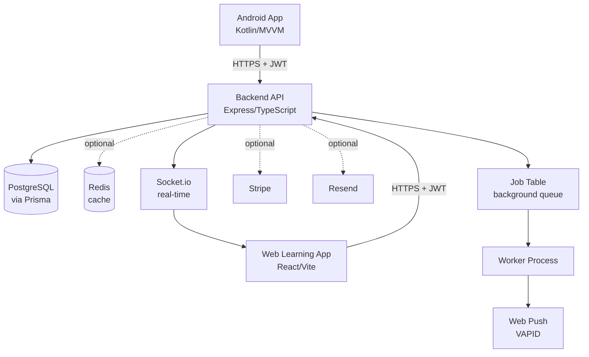
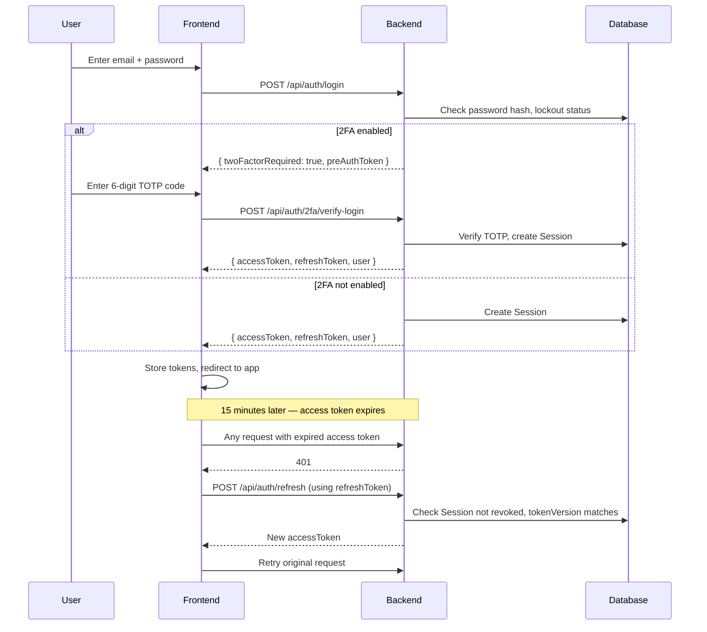
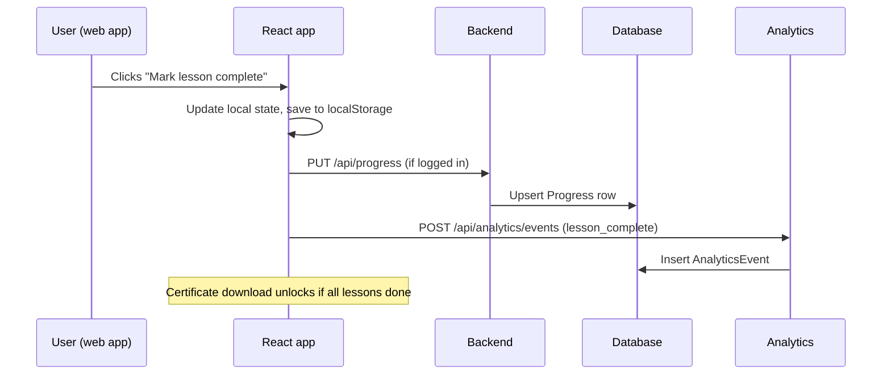

# Architecture

Diagrams below use [Mermaid](https://mermaid.js.org) — they render directly
on GitHub, no image files or generator needed.

## System overview



Dotted lines are optional integrations — the app works without them, just
with reduced features (no caching, no payments, no email) rather than
crashing. See each service file's "graceful no-op" comment for how that's
implemented (`src/services/cache.ts`, `src/services/email.ts`,
`src/routes/paymentRoutes.ts`).

## Auth flow (including 2FA)



## Data flow: a lesson completion



## Folder structure

```
android-app/    Kotlin — MainActivity, MainViewModel, UserRepository,
                data/local (Room), data/remote (Retrofit), di (Hilt)
backend/        TypeScript — src/routes (API endpoints), src/middleware
                (auth, security, rate limiting), src/services (cache, email,
                jobs — each with a graceful no-op fallback), prisma/schema.prisma
web-learning-app/  React — src/components, src/hooks, src/services,
                   src/data (lessons as JSON), src/pages (AdminDashboard)
```

## Why this shape

- **Two frontends, one backend**: Android and the web learning app are
  independent — neither knows the other exists. They both just call the same
  REST API. This means either could be replaced without touching the other.
- **Graceful degradation everywhere**: Redis, Stripe, email, and push
  notifications are all optional — the backend works without any of them
  configured, just with fewer features. This was a deliberate choice so the
  free-tier deployment path (see `DEPLOY_FREE.md`) doesn't require signing up
  for every optional service just to get the core app running.
- **Database-backed job queue instead of Redis/BullMQ**: keeps the free-tier
  deployment story simpler (one fewer service to provision) at the cost of
  polling-based latency (~5 seconds) instead of instant dispatch — a
  deliberate trade documented in `backend/src/worker.ts`.
